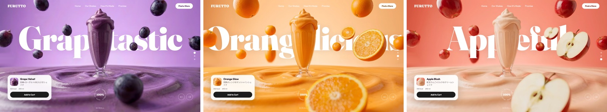

# FURUTTO



スクロールに合わせてフレーバーが切り替わるヒーローLP。
架空のフルーツシェイクブランドで、ポートフォリオ用の制作物です。

**デモ → https://furutto.vercel.app**

---

## 構成

`index.html` 1ファイルで完結。ビルド不要。

| | |
|---|---|
| アニメーション | GSAP 3.12.5 + ScrollTrigger |
| 慣性スクロール | Lenis |
| フォント | Fraunces / Outfit / Noto Sans JP / Shippori Mincho B1 |
| 合計 | 1.5MB（ライブラリ・画像込み） |

ライブラリ3本は `assets/js/` に自前で置いています。CDNは**落ちても404でも気づけない**ため
（実際、開発中に Lenis の CDN パスが404のままで、慣性スクロールが一度も効いていませんでした。
`if (window.Lenis)` のガードがエラーを飲み込むので、コンソールには何も出ません）。

## 起動

```bash
python3 -m http.server 8000
```

→ http://localhost:8000

## デプロイ

`main` に push すると Vercel が自動で本番を更新します。
**手元から `vercel deploy` は実行しないこと** — 経路が2本になると、
GitHub のコードと本番の中身がずれます。

---

## 設計のポイント

### 1枚の写真を5層に割る

ヒーローの素材は、元が1枚の写真です。それを空・グラス・液体・果物に手で切り分け、
**巨大タイポをグラスの手前・液体の奥に挟んでいます**。文字が液面に少し浸かって見えるのがねらいです。

| z | レイヤー |
|---:|---|
| 1 | 空 |
| 5 | 文字 |
| 8 | グラス |
| 9 | 奥の果物 |
| 10 | 液体 |
| 12 | 手前の果物 |

配置はすべて元画像 5500×3072 の座標系を % に変換したもの。
どの画面幅でも、元の写真と同じ構図になります。

### 縦画面では、果物と文字だけを動かす

素材は 1.79:1 の横長。スマホ縦は 0.46:1 なので、高さを埋めると
**横幅の 25.8% しか映らず、果物が1粒も画面に入りません**。トリミングでは解決しません。

そこで縦画面のときだけ、果物と文字を別の座標系に置き直しています。

空・グラス・液体は**元が1枚なので、共通のキャンバスに乗せたまま**にしてあります。
別々に拡縮すると接点がずれて、液体の上端がグラスを横切るただの直線になります。

### 切り替えは1本のタイムラインで持つ

味の切り替えは 1.25 秒。ここで個別の tween を撒くと、GSAP の `killTweensOf` が
**「delay 待ちでまだ動き出していない tween」を取りこぼします**。
取りこぼした1本が後から発火すると、前の味が画面に戻ってくる。

タイムラインごと kill できるよう、`delay` ではなく位置引数を使って1本にまとめています。

---

## そのほか

- `prefers-reduced-motion` に対応（慣性スクロールとスナップを切り、切り替えを瞬時に）
- 実装の詳細と「触ってはいけない関係」は [CLAUDE.md](CLAUDE.md) にまとめています

素材は生成AIで作成し、切り抜きは手作業。ブランド名・文言・店舗・価格はすべて架空です。
